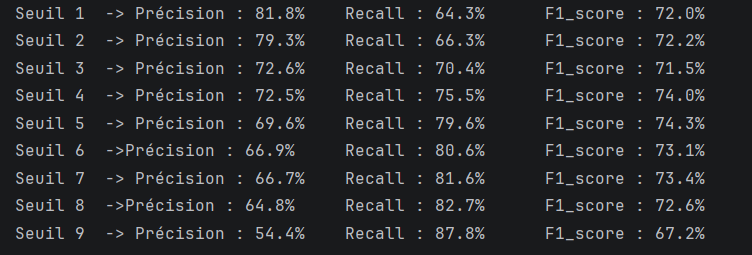
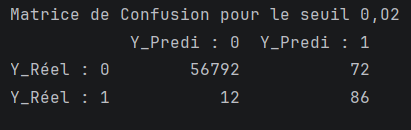

# Détection de fraude par carte bancaire : modélisation par régression logistique et optimisation du risque

## 📌 Présentation du projet

La digitalisation des services bancaires a profondément modifié les habitudes de paiement et entraîné une multiplication du volume des transactions financières. Cette évolution, portée par les avancées technologiques, s'accompagne également d'un développement des fraudes bancaires, faisant de leur détection un enjeu majeur pour les établissements financiers.

Ce projet porte sur la détection automatique des transactions frauduleuses par carte bancaire à l'aide d'une approche statistique fondée sur la régression logistique. L'objectif est de construire un modèle capable d'identifier les transactions susceptibles d'être frauduleuses, tout en prenant en compte le fort déséquilibre entre les transactions normales et frauduleuses.

Une attention particulière est également portée au choix du seuil de décision, afin d'adapter le fonctionnement du modèle aux enjeux de gestion du risque bancaire.

---

## 🎯 Objectifs

Les objectifs principaux du projet sont les suivants :

- Analyser et comprendre le jeu de données de transactions bancaires ;
- Étudier le déséquilibre entre les transactions normales et frauduleuses ;
- Construire un modèle de régression logistique pour la détection de fraude ;
- Identifier les variables statistiquement significatives ;
- Sélectionner les variables pertinentes pour le modèle final ;
- Évaluer les performances du modèle sur des données de test ;
- Comparer différentes valeurs de seuil de décision ;
- Privilégier la détection des fraudes non détectées en tenant compte du contexte métier ;
- Analyser les performances à l'aide de métriques adaptées à une classification déséquilibrée.

---

## 📊 Données

Le jeu de données utilisé dans ce projet contient des transactions par carte bancaire effectuées en septembre 2013 par des titulaires européens.

Il comprend :

- **284 807 transactions** ;
- **492 transactions frauduleuses** ;
- **0,172 % de transactions frauduleuses**.

Le jeu de données est fortement déséquilibré, les transactions normales étant largement majoritaires.

Les variables `V1` à `V28` correspondent à des composantes principales obtenues par Analyse en Composantes Principales (ACP). Pour des raisons de confidentialité, les variables d'origine ne sont pas disponibles.

Les variables `Time` et `Amount` n'ont pas été transformées par ACP.

La variable cible `Class` prend les valeurs suivantes :

- `0` : transaction normale ;
- `1` : transaction frauduleuse.

Le jeu de données n'est pas inclus directement dans ce dépôt. Voir le fichier [`data/README.md`](data/README.md) pour plus d'informations.

---

## 🔬 Méthodologie

La démarche suivie dans ce projet est organisée selon les étapes suivantes :

### 1. Analyse exploratoire et préparation

Une analyse descriptive du jeu de données a été réalisée afin d'étudier sa structure et ses principales caractéristiques.

Aucune valeur manquante n'a été détectée.

Les variables `Time` et `Amount` ont été standardisées afin de les mettre sur une échelle comparable avec les autres variables utilisées dans la modélisation.

Une attention particulière a été portée au fort déséquilibre des classes, caractéristique importante du problème de détection de fraude.

### 2. Modélisation statistique

Le modèle utilisé est une régression logistique formulée dans le cadre des modèles linéaires généralisés (GLM), avec une loi binomiale et une fonction de lien logit.

Une première estimation du modèle a permis d'étudier la significativité statistique des variables explicatives.

Les variables non significatives au seuil de 5 % ont ensuite été retirées progressivement afin d'obtenir un modèle final plus parcimonieux.

### 3. Évaluation du modèle

Après la sélection des variables, les données ont été séparées en deux ensembles :

- Un ensemble d'entraînement (*Train*) ;
- Un ensemble de test (*Test*).

Le modèle final a été estimé sur les données d'entraînement, puis utilisé pour prédire les probabilités de fraude sur les données de test.

Les performances ont été étudiées à l'aide de plusieurs métriques :

- Matrice de confusion ;
- Precision ;
- Recall ;
- F1-score ;
- Courbe ROC et AUC ;
- Courbe Precision-Recall et AUPRC.

---

## 📈 Résultats

Le modèle obtenu présente les performances suivantes :

| Métrique | Résultat |
|---|---:|
| ROC-AUC | **0,961** |
| AUPRC | **0,742** |
| Seuil retenu | **0,02** |
| Precision | **54,4 %** |
| Recall | **87,8 %** |
| F1-score | **67,2 %** |

Le modèle présente une excellente capacité globale à distinguer les transactions frauduleuses des transactions normales, avec une **AUC de 0,961**.

L'**AUPRC de 0,742** constitue également une mesure importante dans ce contexte fortement déséquilibré, car elle permet d'évaluer le compromis entre la précision et le rappel pour la classe minoritaire.

---

## ⚖️ Optimisation du seuil et gestion du risque

Dans le cadre de la détection de fraude bancaire, le choix du seuil de classification constitue une étape importante.

Un seuil plus élevé permet de limiter le nombre de fausses alertes, mais peut conduire à laisser passer davantage de transactions frauduleuses.

À l'inverse, un seuil plus faible permet d'augmenter le nombre de fraudes détectées, au prix d'un nombre plus important de fausses alertes.

Dans ce projet, le seuil de **0,02** a été retenu en privilégiant le **Recall**, afin de limiter le nombre de fraudes non détectées.

Avec ce seuil, le modèle obtient :

- **Precision : 54,4 %**
- **Recall : 87,8 %**
- **F1-score : 67,2 %**

Le choix de ce seuil repose sur une considération métier : dans un contexte bancaire, une fraude non détectée peut représenter un coût plus important qu'une fausse alerte nécessitant une vérification supplémentaire.

Le modèle permet ainsi de détecter près de **9 fraudes sur 10** sur l'échantillon de test.

---

## 📊 Visualisations

### Courbe ROC


### Courbe Precision-Recall


### Analyse du seuil de décision



### Matrice de confusion



---

## 🛠️ Technologies utilisées

- **Python**
- **Pandas**
- **NumPy**
- **Statsmodels**
- **Scikit-learn**
- **Matplotlib**
- **Jupyter / PyCharm**
- **Git & GitHub**
- **LaTeX**

---

## 📁 Structure du projet

```text
fraud-detection-logistic-regression/
│
├── README.md
├── requirements.txt
├── .gitignore
│
├── data/
│   └── README.md
│
├── src/
│   └── fraud_detection.py
│
├── results/
│   ├── roc_curve.png
│   ├── precision_recall_curve.png
│   ├── threshold_analysis.png
│   └── confusion_matrix.png
│git status
└── report/
    └── rapport_fraude_bancaire.pdf
```

## 📄 Rapport

Le rapport détaillé du projet est disponible dans le dossier [`report/`](report/).

---

## 🚀 Perspectives

Ce projet constitue une première approche statistique de la détection de fraude bancaire.

Une amélioration possible serait de comparer les performances de la régression logistique avec des méthodes d'apprentissage automatique plus avancées, notamment :

- Random Forest ;
- XGBoost ;
- Méthodes d'ensemble ;
- Réseaux de neurones.

Une comparaison entre plusieurs modèles pourrait permettre d'étudier le compromis entre **performance prédictive**, **interprétabilité** et **coût des erreurs de classification** dans un contexte bancaire.

---

## 👤 Auteur

**Yves GNONHOUE**

Étudiant en Master Mathématiques et Applications – Parcours Data Science

Projet réalisé dans le cadre de l'étude de la modélisation statistique et de la détection de fraude bancaire.